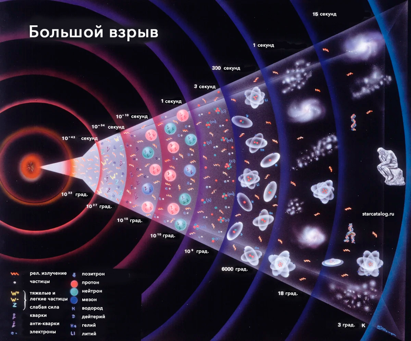
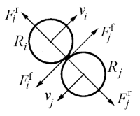

# Цель работы

Цель данной работы — численное моделирование образования планетной системы из газопылевого облака с использованием методов молекулярной динамики, гравитационного взаимодействия, сил трения и слипания частиц.

# Задание

1. Напиcать программу, моделирующую движение N точек в плоскости, испытывающих притяжение к центральной неподвижной точке, не взаимодействующих между собой  и двигающихся по орбитам с первой космической скоростью.

2. Ввести гравитационное взаимодействие между частицами. Убрать неподвижную центральную точку. Добавить отталкивание между частицами при их сближении на расстояние меньше суммы их радиусов. Вывести на экран кинетическую и потенциальную энергии. Сделать импульс системы равным 0. Добавить силы трения между частицами.

3. Включить в модель угловые скорости вращения вокруг собственной оси каждой частицы.

4. Смоделировать трехмерный случай N взаимодействующих частиц с отталкиванием без трения. Вывести на экран проекции движения частиц в плоскостях XY , Y Z, XZ. Нарисовать зависимость кинетической, потенциальной и полной энергии от времени.

5. Ввести в трехмерном случае слипание частиц после того, как они приблизятся на малое расстояние. При образовании большей частицы должны сохраняться суммарные масса и импульс системы.

6. Ввести силы трения. Объяснить вид кинетической и потенциальной энергии.

7. Ввести частицы двух сортов с разной массой и соответствующим массе радиусом. Добавить силу трения между частицами. Вывести на экран график энергии, переходящей в тепло. Объяснить график полной энергии. Ввести частицы с массами, задаваемыми случайным образом, и соответствующими радиусами.

# Образование планетной системы

## Введение

Формирование планетных систем — один из ключевых процессов эволюции Вселенной. Согласно современным представлениям, звёзды и их планетные системы образуются в результате гравитационного сжатия межзвёздных газопылевых облаков. В процессе сжатия облако фрагментируется, формируются протозвёзды и протопланетные диски, в которых впоследствии образуются планеты.

## Теоретическое описание задачи

### Происхождение звёзд и звёздных систем

Согласно теории Фридмана, Леметра, Гамова возникновение Вселенной произошло из точки в результате Большого взрыва примерно 13,7 млрд. лет назад ([рис. @fig-001]).

{#fig-001 width=70%}

В этот момент времени, который берется за начало отсчета, Вселенная имела очень малый размер и экстремально высокие плотность и температуру. С тех пор Вселенная непрерывно расширяется и остывает.  В процессе расширения и охлаждения образовались элементарные частицы, затем атомы, и под действием гравитационной неустойчивости начали формироваться первые структуры: протоскопления, протогалактики, галактики и, наконец, звёзды.

Звёзды, превышающие массу Солнца в десятки раз, быстро эволюционируют и взрываются как сверхновые, выбрасывая тяжёлые элементы, из которых впоследствии формируются новые звёзды и планеты .

### Образование Солнечной системы

Согласно теории образования Солнечной системы, предложенной Отто Шмидтом (СССР, 1944 год), газопылевое облако, из которого позднее образовались планеты и Солнце нашей Солнечной системы вращалось, и по мере гравитационного сжатия газопылевого облака расстояние всех его частей от оси вращения сокращалось и скорость вращения сгущающегося облака увеличивалась. В плоскости, перпендикулярной оси вращения, сжатие происходило медленнее, и потому облако, бывшее изначально шаровидным, становилось все более плоским. Из-за гравитационной неустойчивости на периферии формирующегося диска отделилось кольцо вещества. Оставшееся облако продолжало сжиматься и вращаться еще быстрее. Затем от него отделилось новое кольцо вещества, и кольца вещества сгустились в планеты ([рис. @fig-002]).

{#fig-002 width=70%} 

Зависимость скорости обращения планет от расстояния до Солнца соответствует третьему закону Кеплера - скорость убывает обратно пропорционально корню квадратному из расстояния до центра:

$$
v \sim \frac{1}{\sqrt{r}}
$$

где $r$ — расстояние до центра.

##  Математическая модель

###  Гравитационное взаимодействие

Проведем моделирование одного из этапов эволюции Вселенной — образование некой «солнечной» системы из межзвездного газа. Так как число моделируемых частиц весьма ограничено, то можно сказать, что в этой модели планеты образуются из уже сформировавшихся газопылевых уплотнений, которыми и являются задаваемые частицы.

Потенциальная энергия гравитационного взаимодействия системы частиц описывается формулой:

$$
U_i = -\sum_{j \neq i} \frac{\gamma m_i m_j}{r_{ij}}, \quad U = \frac{1}{2} \sum_i U_i
$$

где $\gamma$ — гравитационная постоянная, $m_i$, $m_j$ — массы частиц, $r_{ij}$ — расстояние между ними.

Полная потенциальная энергия системы частиц равна:

$$
U = \frac{1}{2} \sum_{i} U_{i} 
$$

Множитель $\frac{1}{2}$ необходим, так как энергия взаимодействия между каждой парой частиц учитывается в этой сумме дважды.

Гравитация — дальнодействующая сила, что требует учёта взаимодействий между всеми парами частиц. Поэтому нельзя игнорировать взаимодействие между удаленными частицами. Это приводит к сложности $O(N^2)$, что ограничивает размер моделируемых систем, даже на современных компьютерах.

### Начальные условия

Распределение частиц в плоскости в начальный момент времени задается случайным образом, при достаточно большом количестве частиц распределение будет равномерным в плоскости диска, если для двумерного случая модуль радиус-вектора выбирать как $r = r0*√random$:

- радиус: $r = r_0 \cdot \text{random}$
- угол: $\alpha = 2\pi \cdot \text{random}$
- начальная скорость, которая находится по третьему закону Кеплера:

$$
v_x = -y \cdot \omega_0 \left( \frac{r_0}{r} \right)^{3/2}, \quad v_y = x \cdot \omega_0 \left( \frac{r_0}{r} \right)^{3/2}, \quad v_z = 0
$$

где $\omega_0$ — угловая скорость на расстоянии $r_0$, а $r_0$ – радиус газопылевого диска.

### Силы отталкивания и трения

Для частиц, у которых расстояние между центрами меньше суммы их радиусов, необходимо ввести силы трения и отталкивания ([рис. @fig-003]).

{#fig-003 width=70%}

Это делается для удобства написания программы, так как в реальности при столкновении двух газопылевых облаков произойдет их слипание и при слишком больших скоростях возможно их разбиение на более мелкие.

#### Силу отталкивания можно взять:

$$
F^r(b) = k \left( \left( \frac{a}{b} \right)^8 - 1 \right)
$$

где $a = R_i + R_j$ — сумма радиусов частиц $i$ и $j$,
и  $b = |\mathbf{r}_{i,j}| = |\mathbf{r}_i - \mathbf{r}_j|$ — модуль радиус-вектора взаимодействия.

#### Сила трения

Сила трения перпендикулярна радиус-вектору взаимодействия b и
направлена против движения частиц относительно друг друга. Единичный вектор вдоль силы трения для двумерной модели равен:

$$
n = \frac{(-b_y, b_x)}{\sqrt{b_x^2 + b_y^2}}
$$

Относительная скорость поверхностей частиц, перпендикулярная радиусу:

$$
W_\perp = (v_i - v_j) \cdot n - \omega_i R_i - \omega_j R_j
$$

где $\omega_i$ и $\omega_j$ — угловые скорости вращения частиц $i$ и $j$ и $W = \mathbf{v}_i - \mathbf{v}_j$ - относительная скорость двух взаимодействующих частиц.

В простейшем приближении коэффициент трения определяется как:

$$
\mu = \beta W_{\perp} 
$$

где:
- $\beta$ — постоянный коэффициент,
- $W_{\perp}$ — перпендикулярная компонента относительной скорости $W$.

Модуль силы трения равен:

$$
F^f = \mu F^r(b), \quad \mu = \beta W_\perp
$$

где:
- $\mu$ — коэффициент трения, зависящий от скорости  $W_{\perp}$,
- $F_{r}(b)$ — радиальная сила взаимодействия, зависящая от расстояния $b$.

И тогда вектор силы трения:

$$
\mathbf{F}_f = \beta W_\perp F^r(b) \mathbf{n}
$$

### Вращение частиц

Угловую скорость каждой частицы можно найти с помощью системы уравнений:

$$
I_i \varepsilon_i = R_i \sum \frac{b}{R_i + R_j} F^f_{ij}, \quad \frac{d\omega_i}{dt} = \varepsilon_i
$$

Где момент инерции определяется как:

$$
I_i = \frac{2}{5} m_i R_i^2
$$

а энергия вращения:

$$
E_{\text{rot}} = \frac{I_i \omega_i^2}{2}
$$

Для системы, в которой есть сила трения, полная энергия не сохраняется, часть энергии в результате трения переходит в тепло. Энергию, перешедшую в тепло, можно найти в виде разности начальной и текущей полной энергии.

###  Слипание частиц

Возможно полное слипание пары частиц. В результате образуется одна, радиус которой вычисляется как:

- $R = \sqrt[3]{R_i^3 + R_j^3}$

Масса равна сумме масс слипшихся облаков:

- $m = m_i + m_j$

а координаты новой частицы вычисляются по формуле:

- $\mathbf{r} = \frac{m_i \mathbf{r}_i + m_j \mathbf{r}_j}{m_i + m_j}$

Аналогично вычисляется скорость:

- $\mathbf{v} = \frac{m_i \mathbf{v}_i + m_j \mathbf{v}_j}{m_i + m_j}$

Надо иметь ввиду, что при слипании частиц гравитационная энергия результирующей частицы не равна сумме гравитационных энергий исходных частиц. Тогда гравитационная энергия новой частицы:

$$
E_g = -\frac{\gamma m^2}{2R}
$$

##  Описание модели 

### Двумерная модель с центральным притяжением

На первом этапе моделируется движение частиц в плоскости под действием центральной неподвижной массы. Частицы движутся по орбитам с первой космической скоростью, не взаимодействуя друг с другом.

### Введение гравитации и отталкивания

Убирается центральная точка, вводится гравитационное взаимодействие между частицами. При сближении частиц на расстояние, меньшее суммы радиусов, включается сила отталкивания. Контролируется полный импульс системы (должен быть равен нулю). На экран выводятся кинетическая и потенциальная энергии.

###  Учёт вращения

Добавляются угловые скорости вращения частиц вокруг собственной оси. Вводится сила трения.

###  Трёхмерная модель

Моделирование переносится в трёхмерное пространство. Выводятся проекции движения на плоскости $XY$, $XZ$, $YZ$. Строятся графики зависимости энергий от времени.

###  Слипание частиц

В трёхмерной модели вводится механизм слипания частиц при их сближении. Сохраняются масса и импульс системы.

###  Трение и диссипация энергии

Вводится сила трения. Анализируется поведение кинетической и потенциальной энергии. Часть энергии переходит в тепло.

### Частицы разных сортов

Вводятся частицы двух типов с разной массой и радиусом. Добавляется трение. Выводится график энергии, переходящей в тепло. Затем массы и радиусы задаются случайным образом.

## Заключение

В результате выполнения работы было исследовано образование планетной системы, изучены формулы для построения численной модели формирования планетной системы из газопылевого облака. Модель включает гравитационное взаимодействие, силы отталкивания и трения, вращение и слипание частиц. 

# Выводы

Нами было произведено исследование для численного моделирования образования планетной системы из газопылевого облака с использованием методов молекулярной динамики, гравитационного взаимодействия, сил трения и слипания частиц.
